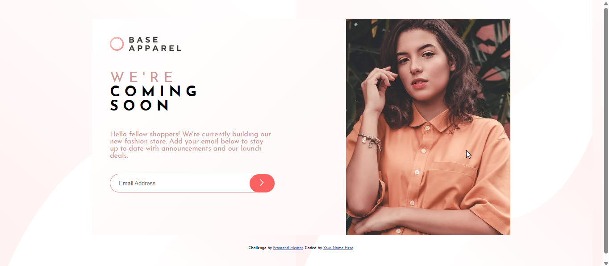
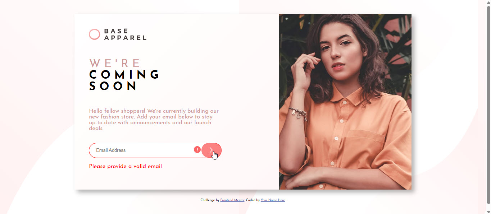

# Frontend Mentor - Base Apparel coming soon page solution

This is a solution to the [Base Apparel coming soon page challenge on Frontend Mentor](https://www.frontendmentor.io/challenges/base-apparel-coming-soon-page-5d46b47f8db8a7063f9331a0). Frontend Mentor challenges help you improve your coding skills by building realistic projects.

## Table of contents

- [Overview](#overview)
  - [The challenge](#the-challenge)
  - [Screenshot](#screenshot)
  - [Links](#links)
- [My process](#my-process)
  - [Built with](#built-with)
  - [What I learned](#what-i-learned)
- [Author](#author)

## Overview

### The challenge

Users should be able to:

- View the optimal layout for the site depending on their device's screen size
- See hover states for all interactive elements on the page
- Receive an error message when the `form` is submitted if:
  - The `input` field is empty
  - The email address is not formatted correctly

### Screenshot




### Links

- Solution URL: [Git Repository](https://github.com/phophobee/base-apparel)
- Live Site URL: [GitHub Pages](https://phophobee.github.io/base-apparel/)

## My process

### Built with

- Semantic HTML5 markup
- CSS custom properties
- Flexbox
- JavaScript

### What I learned

```html
<body>
  <main class="container">
    <section class="card">
      <div class="left-box">
        
        <h1><span>W e ' r e</span><br />C O M I N G<br />S O O N</h1>

        <p>
          Hello fellow shoppers! We're currently building our new fashion store.
          Add your email below to stay up-to-date with announcements and our
          launch deals.
        </p>
        <form id="emailForm" novalidate>
          <div class="form-group">
            <input type="email" id="email" placeholder="Email Address" />
            <button type="submit" class="submit-btn">
              
            </button>
            <span class="error-icon"
              ></span>
          </div>
          <p class="error-message" id="errorMsg">
            Please provide a valid email
          </p>
        </form>
      </div>
      <div class="right-box">
        
      </div>
    </section>
  </main>
  <footer>
    <p class="attribution">
      Challenge by
      <a href="https://www.frontendmentor.io?ref=challenge" target="_blank"
        >Frontend Mentor</a
      >. Coded by <a href="#">Your Name Here</a>.
    </p>
  </footer>
  <script src="script.js"></script>
</body>
```

```css
@font-face {
  font-family: "Josefine Sans";
  src: url("./fonts/JosefinSans-Regular.ttf") format("truetype");
}

@font-face {
  font-family: "Josefine Bold";
  src: url("./fonts/JosefinSans-Bold.ttf") format("truetype");
}

@font-face {
  font-family: "Josefine Italic";
  src: url("./fonts/JosefinSans-Italic.ttf") format("truetype");
}

body {
  font-family: "Josefine Sans";
  font-size: 16px;
  display: flex;
  flex-direction: column;
  justify-content: center;
  align-items: center;
  background-image: url("./images/bg-pattern-desktop.svg");
  height: 100vh;
}

.container {
  width: 70%;
  margin-bottom: 20px;
}

.card {
  display: flex;
  flex-direction: row;
  background: linear-gradient(135deg, hsl(0, 0%, 100%), hsl(0, 100%, 98%));
  box-shadow: 10px 10px 16px rgba(0, 0, 0, 0.3);
}

.left-box {
  width: 40%;
  display: flex;
  flex-direction: column;
  padding: 50px;
}

.logo {
  width: 200px;
  margin-bottom: 30px;
}

h1 {
  font-family: "Josefine Bold";
  font-size: 40px;
}

h1 span {
  font-family: "Josefine Sans";
  text-transform: uppercase;
  color: hsl(0, 36%, 70%);
  font-weight: 200;
}

.left-box p {
  color: hsl(0, 36%, 70%);
  font-size: 20px;
}

.form-group {
  position: relative;
  display: flex;
  align-items: center;
  margin-top: 20px;
}

input[type="email"] {
  padding: 1rem 1.5rem;
  border-radius: 30px;
  border: 1px solid hsl(0, 36%, 70%);
  font-size: 1rem;
  outline: none;
  width: 100%;
}

input:focus {
  border-color: hsl(0, 93%, 68%);
}

.submit-btn {
  position: absolute;
  right: 0;
  background-color: hsl(0, 93%, 68%);
  border: none;
  border-radius: 30px;
  padding: 0.9rem 1.8rem;
  cursor: pointer;
  transition: 0.3s;
}

.submit-btn:hover {
  opacity: 0.8;
}

.error-icon {
  display: none;
  position: absolute;
  right: 4.5rem;
  color: red;
  font-weight: bold;
  font-size: 1.2rem;
}

.error-message {
  display: none;
}

.error input {
  border: 2px solid red;
}

.error .error-icon {
  display: block;
}

.error .error-message {
  display: block;
  color: red;
}

.right-box {
  width: 40%;
  overflow: hidden;
  margin-left: 150px;
}

.hero-img {
  width: 100%;
  height: 100%;
  object-fit: cover;
}

.attribution {
  font-size: 11px;
  text-align: center;
}
.attribution a {
  color: hsl(228, 45%, 44%);
}
```

```js
const form = document.getElementById("emailForm");
const emailInput = document.getElementById("email");
const errorMsg = document.getElementById("errorMsg");
const formGroup = document.querySelector(".form-group");

form.addEventListener("submit", function (e) {
  e.preventDefault();

  const email = emailInput.value.trim();
  const emailPattern = /^[^ ]+@[^ ]+\.[a-z]{2,3}$/;

  if (email === "" || !emailPattern.test(email)) {
    form.classList.add("error");
  } else {
    form.classList.remove("error");
    alert("Thank you! We'll notify you at " + email);
    emailInput.value = "";
  }
});
```

## Author

- Frontend Mentor - [@phophobee](https://www.frontendmentor.io/profile/phophobee)
